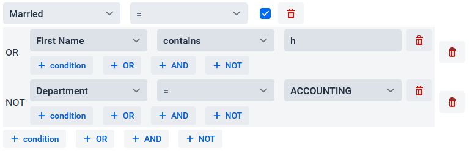

[](https://vaadin.com/directory/component/grid-filter-for-vaadin)
[](https://mvnrepository.com/artifact/software.xdev/vaadin-grid-filter)
[](https://github.com/xdev-software/vaadin-grid-filter/actions/workflows/check-build.yml?query=branch%3Adevelop)
[](https://sonarcloud.io/dashboard?id=xdev-software_vaadin-grid-filter)


# vaadin-grid-filter

A customizable Vaadin Flow component for filtering Grids.



## Features
* Customizable and dynamic filter UI
  * Most common filters, operations and value types are supported out of the box
  * Nested filters (AND, OR, NOT)
    * depth can be limited
  * customizable operations (=,>,<,contains,is empty)
  * support for multiple value types
    * can easily be bound with Vaadin components
* Query parameter support
* Support for custom translations

> [!NOTE]
> If you are looking for a simpler component you may check out our [simple-grid-filter](https://github.com/xdev-software/vaadin-simple-grid-filter).

## Usage

Here is a very simple example how the GridFilter can be used:
```java
Grid<Person> grid = createGrid();

GridFilter<Person> filter = GridFilter.createDefault(grid)
  .withFilterableField("ID", Person::id, Integer.class)
  .withFilterableField("First Name", Person::firstName, String.class);

this.add(filter, grid);
```

To get started further it's recommended to have a look at the [demo](./vaadin-grid-filter-demo).<br/>
A description how to get it running can be found [below](#run-the-demo).

> [!IMPORTANT]
> This component is designed for "in memory" filtering of small to medium sized amounts of data.

> [!NOTE]
> Filtering multiple thousand items with complex filtering conditions can drastically impact performance and make the UI unresponsive!<br/> In these cases it's recommended to use backend filtering solutions like database queries or search engines like [ElasticSearch](https://en.wikipedia.org/wiki/Elasticsearch) in combination with a customized UI search framework. If you need help in implementing these feel free to [contact us](https://xdev.software/en/services/support).

## Installation
[Installation guide for the latest release](https://github.com/xdev-software/vaadin-grid-filter/releases/latest#Installation)

#### Compatibility with Vaadin

| Vaadin version | Grid-Filter version |
| --- | --- |
| Vaadin 24+ (latest) | ``1+`` |

## Run the Demo
* Checkout the repo
* Run ``mvn install && mvn -f vaadin-grid-filter-demo spring-boot:run``
* Open http://localhost:8080

<details>
  <summary>Show example</summary>
  
  
</details>

## Support
If you need support as soon as possible and you can't wait for any pull request, feel free to use [our support](https://xdev.software/en/services/support).

## Contributing
See the [contributing guide](./CONTRIBUTING.md) for detailed instructions on how to get started with our project.

## Dependencies and Licenses
View the [license of the current project](LICENSE) or the [summary including all dependencies](https://xdev-software.github.io/vaadin-grid-filter/dependencies)
